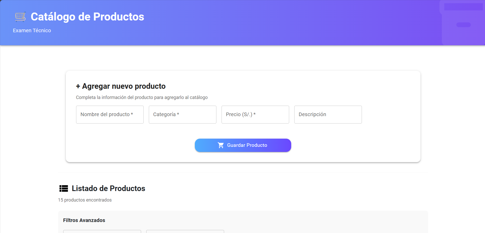
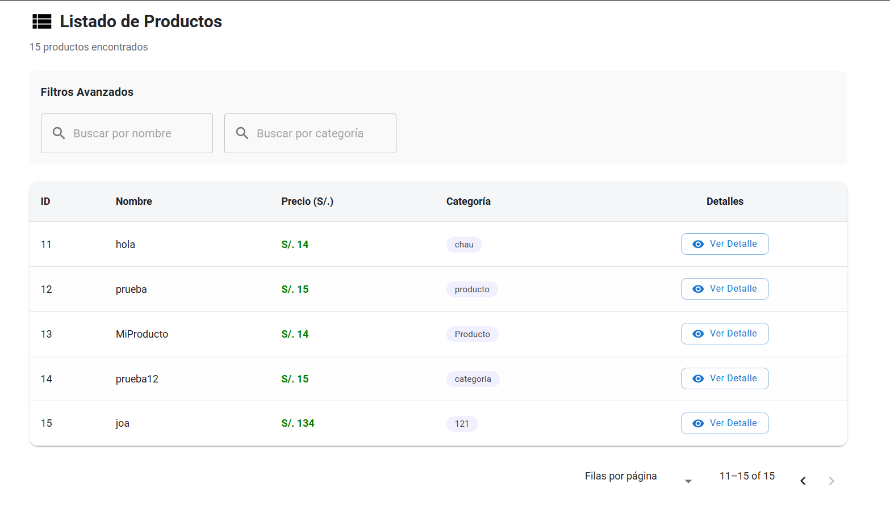
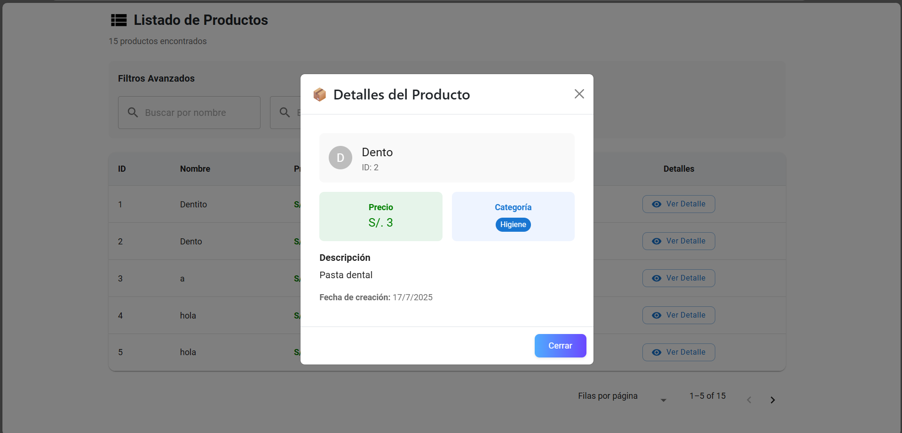

# Catálogo de Productos – Proyecto Full Stack (.NET + React)

##  Descripción del proyecto

Este proyecto es una aplicación web para gestionar productos, desarrollada con:
- **Backend:** ASP.NET Core 8 + Entity Framework InMemory
- **Frontend:** React + Material UI

Permite:
- Registrar productos (nombre, precio, categoría)
- Listarlos y filtrarlos
- Ver detalles por producto(descripcion)

## Cómo ejecutar el proyecto

###  Requisitos previos

- [.NET 8 SDK](https://dotnet.microsoft.com/en-us/download)
- [Node.js (v18 o superior)](https://nodejs.org)
- [npm](https://www.npmjs.com/) o [yarn](https://yarnpkg.com/)


### Backend (.NET Core)
El primer paso a realizar es
+ Abri una terminal en la carpeta del backend(ProductCatalogApi)
2. Ejecuta:

```bash
dotnet run
```

Esto levantará el backend en `https://localhost:5059`  

Documentación de la API (Swagger)
La API cuenta con documentación interactiva generada automáticamente con Swagger.
Una vez que el backend esté corriendo, puedes acceder a ella desde:

 URL: http://localhost:5059/swagger/index.html

---

### 🌐 Frontend (React)
En este caso se abre la terminal en la carpeta del frontend(product-catalog-frontend)
1. Se ejecuta
```
npm install
npm start
```

Esto levantará el frontend en `http://localhost:3000`

> RECOMENDACION:
El backend corriendo primero y que el CORS lo permita (ya está configurado para `localhost:3000`)
---

## Estructura del Código

### 🧠 Enfoque

Se usó una arquitectura **modular y limpia"** facilita la lectura, mantenimiento y escalabilidad.

- **Backend**: Basado en controladores REST. Usa EF InMemory como base de datos de prueba.
- **Frontend**: Desarrollado con componentes funcionales de React y hooks (`useState`, `useEffect`), además de `Material UI` para el diseño visual.
---

###  Backend (ASP.NET Core)

```
ProductCatalogApi/
├── Controllers/
│   └── ProductsController.cs  → Controlador con rutas CRUD
├── Data/
│   └── ProductContext.cs      → Contexto EF con base de datos en memoria
├── Models/
│   └── Product.cs             → Modelo de datos del producto
├── Program.cs                 → Configuración general de la API
```

---

###  Frontend (React + MUI)

```
src/
├── components/
│   ├── Header.js              → Cabecera visual
│   ├── Footer.js              → Pie de página
│   ├── ProductForm.js         → Formulario para registrar productos
│   ├── ProductList.js         → Tabla con listado y filtros
│   └── ProductDetail.js       → Modal con detalle del producto
├── App.js                     → Estructura principal y ruteo entre componentes
```

---

##  Validaciones

- El **backend valida** que:
  - El nombre y la categoría no estén vacíos
  - El precio sea mayor a 0
- El **frontend también previene** envíos incompletos desde el formulario

INTERFAZ:
###  Formulario de Producto

### Listado de Productos

### Detalle Producto

